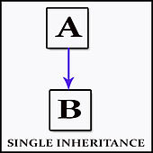

<section id="themes">
	<h2>Themes</h2>
		<p>
			Set your presentation theme: <br>
			<!-- Hacks to swap themes after the page has loaded. Not flexible and only intended for the reveal.js demo deck. -->
                        <a href="#" onclick="document.getElementById('theme').setAttribute('href','css/theme/black.css'); return false;">Black (default)</a> -
			<a href="#" onclick="document.getElementById('theme').setAttribute('href','css/theme/white.css'); return false;">White</a> -
			<a href="#" onclick="document.getElementById('theme').setAttribute('href','css/theme/league.css'); return false;">League</a> -
			<a href="#" onclick="document.getElementById('theme').setAttribute('href','css/theme/sky.css'); return false;">Sky</a> -
			<a href="#" onclick="document.getElementById('theme').setAttribute('href','css/theme/beige.css'); return false;">Beige</a> -
			<a href="#" onclick="document.getElementById('theme').setAttribute('href','css/theme/simple.css'); return false;">Simple</a> <br>
			<a href="#" onclick="document.getElementById('theme').setAttribute('href','css/theme/serif.css'); return false;">Serif</a> -
			<a href="#" onclick="document.getElementById('theme').setAttribute('href','css/theme/blood.css'); return false;">Blood</a> -
			<a href="#" onclick="document.getElementById('theme').setAttribute('href','css/theme/night.css'); return false;">Night</a> -
			<a href="#" onclick="document.getElementById('theme').setAttribute('href','css/theme/moon.css'); return false;">Moon</a> -
			<a href="#" onclick="document.getElementById('theme').setAttribute('href','css/theme/solarized.css'); return false;">Solarized</a>
		</p>
</section>

H:

# ArrayList

por Daniel Torres y Andrés Ortega

H:

# Índice

 1. Introducción <!-- .element: class="fragment" data-fragment-index="1"-->
 1. Descripción <!-- .element: class="fragment" data-fragment-index="2"-->
 1. ArrayList <!-- .element: class="fragment" data-fragment-index="3"-->
 1. Clases Ayudantes <!-- .element: class="fragment" data-fragment-index="4"-->
 1. Implementación <!-- .element: class="fragment" data-fragment-index="5"-->
 
H:

## Introducción

We already know:

<li class="fragment"> An object is a _data structure_ for storing user-defined _attributes_ (which may be other objects even of the same type), and _methods_ to manipulate them
<li class="fragment"> To use an object: Declare & initialize it and then call functions on it

H:

## Descripción
What is?

> Is when an object or class B is based on another object or class A

V:

## Usos
We say:

<li class="fragment"> B is _sublass_ of A
<li class="fragment"> A is _superclass_ of B
<li class="fragment"> A and B form a _class hierarchy_

V:

## Ventajas

<figure>
    
    <figcaption>Single inheritance</figcaption>
</figure>

V:

## Comparación

<figure>
    
    <figcaption>Multiple inheritance</figcaption>
</figure>

V:

## Comparación

<figure>
    
    <figcaption>Multilevel inheritance</figcaption>
</figure>

V:

## Sintaxis
Advantages

<li class="fragment"> It is a mechanism for code reuse
<li class="fragment"> It allows (independent) extensions of the original software via public classes and interfaces

V:

## Sintaxis
Example:

> Consider the problem of visually representing some integer sequences as a tile of squares with different hue values

H:

## ArrayList
What is?

> is the provision of a single interface to entities of different types
[Bjarne Stroustrup (February 19, 2007). "Bjarne Stroustrup's C++](http://www.stroustrup.com/glossary.html#Gpolymorphism)

V:

## Métodos Auxiliares
Types

1. Ad hoc polymorphism <!-- .element: class="fragment" data-fragment-index="1"-->
1. Parametric polymorphism <!-- .element: class="fragment" data-fragment-index="2"-->
1. Subtyping <!-- .element: class="fragment" data-fragment-index="3"-->

## Ejemplo Círculos
What is?

> is the provision of a single interface to entities of different types
[Bjarne Stroustrup (February 19, 2007). "Bjarne Stroustrup's C++](http://www.stroustrup.com/glossary.html#Gpolymorphism)


H:

## Clases Auxiliares 

> when a function denotes different implementations depending on a limited range of individually specified types

Supported in many languages via function overloading <!-- .element: class="fragment" data-fragment-index="1"-->

V:

## IntList
Continuing our previous example:

```processing
// Subclass Padovan
class Padovan extends Sequence {
  int compute(int n) {
    if (n == 1 || n == 2 || n == 3)
      return 1;
    if ( n > 3)
      return compute(n-2) + compute(n-3);
    return -1;
  }
  
  void display(int terms) {
    int square_width = width / terms;
    for (int i = 0; i < terms; i++) {
      fill(hue, 100, map(compute(i+1), 0, compute(terms), 0, 100));
      rect(i*square_width, height(), square_width, 50);
    }
  }
  
  // Method overloading
  void display() {
    display(5);
  }
}
```

V:

## FloatList
Continuing our previous example:

```processing
// Object declaration
Fibonacci fSeq;
Padovan pSeq;
int term = 12;

void setup() {
  size(720,640);
  colorMode(HSB, 360, 100, 100);
  // Object instantiation
  fSeq = new Fibonacci();
  pSeq = new Padovan();
}

void draw() {
  background(0);
  // Object use:
  pSeq.setHeight(mouseY);
  // Call to the overloaded method
  pSeq.display();
}

void keyPressed() {
  // Object use:
  println(term + " term Fibonacci value is: " + fSeq.compute(term));
  println(term + " term Padovan value is: " + pSeq.compute(term));
}
```

## StringList
What is?

> is the provision of a single interface to entities of different types
[Bjarne Stroustrup (February 19, 2007). "Bjarne Stroustrup's C++](http://www.stroustrup.com/glossary.html#Gpolymorphism)

H:

## Implementación en Proyecto

> when code is written without mention of any specific type and thus can
be used transparently with any number of new types

V:

## Ejemplo Código

Also known as:

* [Generic programming](https://en.wikipedia.org/wiki/Generic_programming) in the OOP community
* _Polymorphism_ in the functional programming community

H:

## References

* [Inheritance](https://en.wikipedia.org/wiki/Inheritance_(object-oriented_programming)
* [Bjarne Stroustrup (February 19, 2007). "Bjarne Stroustrup's C++](http://www.stroustrup.com/glossary.html#Gpolymorphism)
* [Polymorphism](https://en.wikipedia.org/wiki/Polymorphism_(computer_science)
* [Subtyping](https://en.wikipedia.org/wiki/Subtyping)

V:

## Further reading:

* [Is-a relationship](https://en.wikipedia.org/wiki/Is-a)
* [Java Interfaces](https://en.wikipedia.org/wiki/Interface_(Java)

H:

## Workshop

> Implement a hierarchical design for your [tangram](https://en.wikipedia.org/wiki/Tangram),
taking into account different visual representations along it
